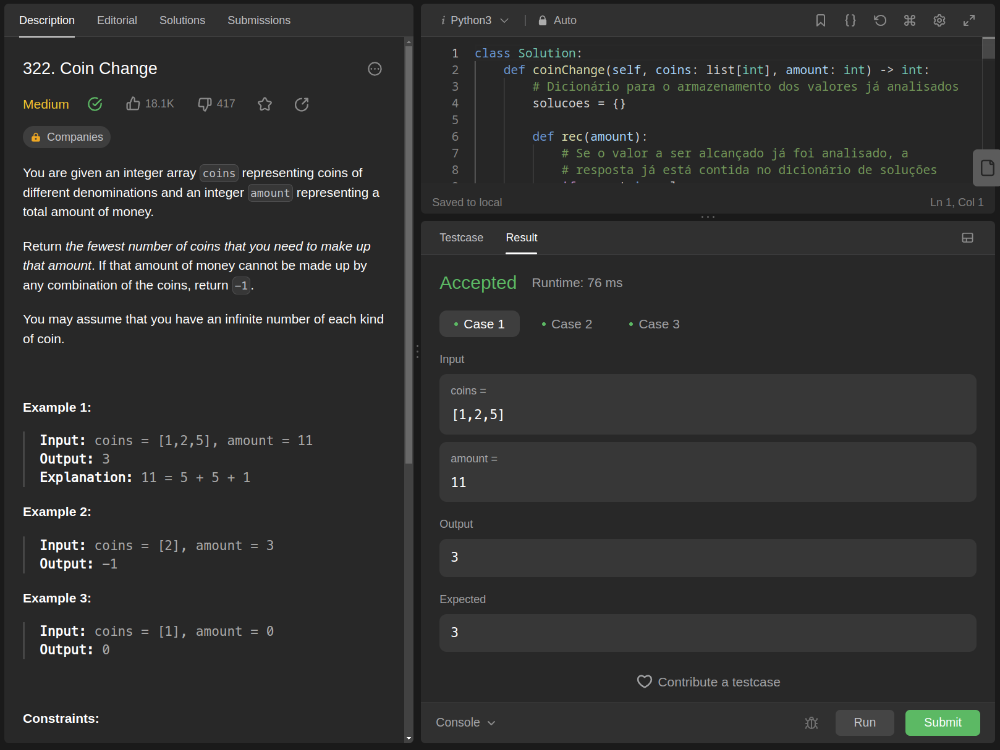
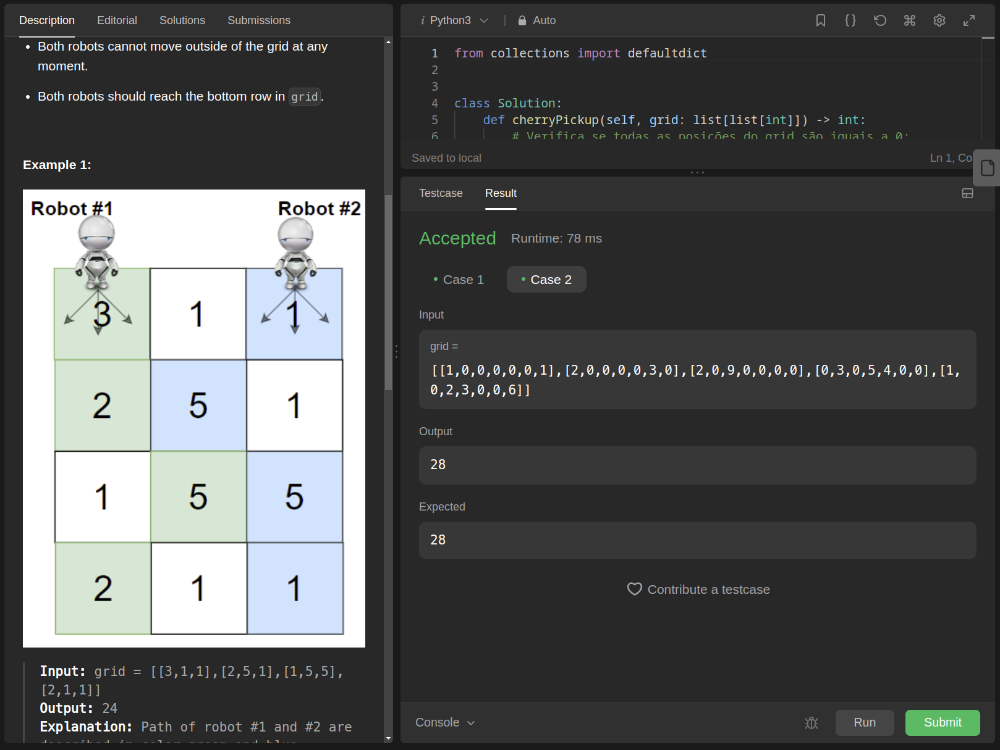
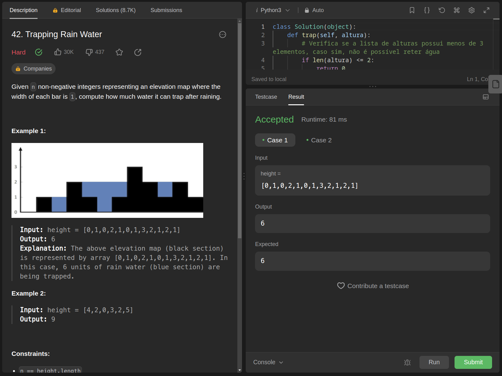

# Exercícios Resolvidos

**Conteúdo da Disciplina**: Programação Dinamica

## Alunos

|Matrícula | Aluno |
| -- | -- |
| 20/0017772  |  Fellipe Pereira da Costa Silva |
| 18/0104390  |  Lameque Fernandes de Azevedo |

## Sobre 

O repositório contém soluções para algumas questões de juíz online. Segue a lista dos exercicios escolhidos:

- Coin Change - (https://leetcode.com/problems/coin-change/description/)
- Cherry Pickup II - (https://leetcode.com/problems/cherry-pickup-ii/description/)
- Maximum Profit in Job Scheduling - (https://leetcode.com/problems/maximum-profit-in-job-scheduling/)
- Trapping Rain Water - (https://leetcode.com/problems/trapping-rain-water/description/)

## Screenshots

- Coin Change



- Cherry Pickup II



- Trapping Rain Water



## Instalação 
Para executar as questões deste repositório, é necessário ter um interpretador python3.

## Uso 

Passo a passo:
1. Clone o repositório utilizando o seguinte comando: ```git clone https://github.com/projeto-de-algoritmos/PD-ExerciciosJuizesOnline.git```
2. Entre na pasta da questão que deseja executar: ```cd <pasta_da_questao>```
3. Rodar questão: ```python3 <nome_do_arquivo_executavel>```

*OBS*: Caso queira executar a questão com uma das entradas de exemplo fornecidas, utilize o seguinte comando: ```python3 <nome_do_arquivo_executavel> < in.txt``` 
Dessa forma, será possível testar a questão com os exemplos de entrada fornecidos.

## Apresentação

Assista o vídeo explicativo do projeto clicando [aqui](assets/apresentacao.mp4).

Observação: A apresentação está em formato .mp4, portanto, faça o download para assisti-la.